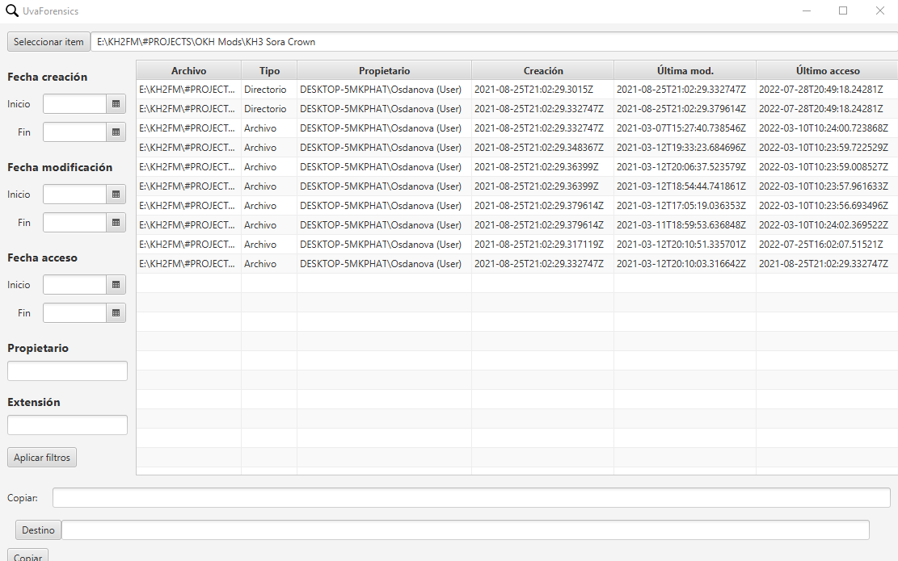

# Simple Kotlin App

This is a simple project I made when I was studying my degree. It's made with Kotlin and the TornadoFx library for the UI.
Unluckily I only saved the compiled project, so no code.

The app reads all files within a folder, can filter the files by multiple parameters and can copy files to another location.

